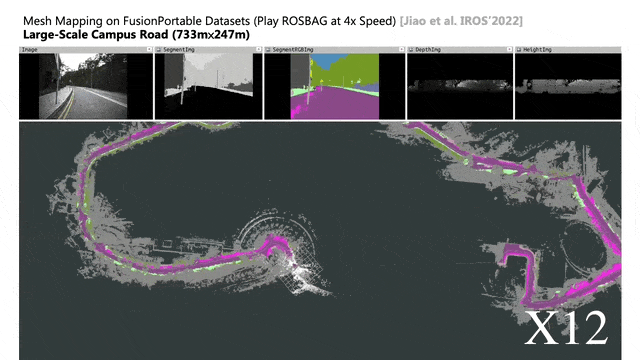

<div align="center">
  <!-- <a href="">
    
  </a> -->
  <a href="">
    
  </a> 
  <!-- <a href="">
    
  </a>   -->
  <!-- <a href="">
    
  </a>     -->
</div>

<!--
# Cobra

Cobra is a C++/Python library for metric-semantic-driven navigation in both unstructured and structured environments for mobile robots. Cobra is modular, ROS-enabled, and runs on CPU+GPU.

Cobra comprises four **modules**:
- A fast and accurate LiDAR-Vision-Inertial Odometry (LVIO) ([Cobra-State-Estimation](http://gitlab.ram-lab.com/ramlab_dataset_sensor/code/r3live))
- A semantic segmentation (perception) module (high-performance) ([Cobra-Semantics](http://gitlab.ram-lab.com/ramlab_dataset_sensor/mapping_codebase/hkustgz_segnet))
- A metric-semantic dense mapping system ([Cobra-Mapping](http://gitlab.ram-lab.com/ramlab_dataset_sensor/mapping_codebase/nvblox)) 
  and its ROS-enabled plugins ([Cobra-ROS-Mapping](http://gitlab.ram-lab.com/ramlab_dataset_sensor/mapping_codebase/glimpse_nvblox_ros1))
- A metric-semantic global planner ([Cobra-Planner](http://gitlab.ram-lab.com/ramlab_dataset_sensor/mapping_codebase/cobra_planner))
<!--
- A solver for trajectory optimization (local planner) and control ([TBC](xxx))
-->
<!-- - Tool functions:
  - A toolbox to support the debug and monitor of Cobra ([Cobra-Tool](http://gitlab.ram-lab.com/ramlab_dataset_sensor/mapping_codebase/cobra_tools)) -->
<!-- - A tool to convert LiDAR points into depth/height images ([Cobra-Tool-p2img](http://gitlab.ram-lab.com/ramlab_dataset_sensor/mapping_codebase/pointcloud_image_converter)) -->

<!-- Click on the following links to install Cobra's modules and get started!  -->

## 1. Installation
Clone the code
```shell script
mkdir -p catkin_ws/src
cd catkin_ws/src
git clone https://github.com/HKUSTGZ-IADC/cobra --recursive 
wstool merge cobra/cobra_https.rosinstall
wstool update
cd cobra
```
Build the docker environment **(X86 PC)**: change the cuda version of **Dockerfile_x86** (first line) for you GPU 
```shell script
docker build -t cobra_x86:ros_noetic-py3-torch-cuda -f docker/Dockerfile_x86 .
```
Build the docker environment **(Jetson - ARM PC)**
```shell script
docker build -t cobra_jetson:ros_noetic-py3-torch-jetpackr35 -f docker/Dockerfile_jetson .
```
Create the docker container
```shell script
docker pull cobra_x86:ros_noetic-py3-torch-cuda
nvidia-docker run -e DISPLAY -v ~/.Xauthority:/root/.Xauthority:rw --network host \
  -v /tmp/.X11-unix:/tmp/.X11-unix:rw \
  -v volume_path_to_host:volume_path_to_docker \
  --privileged --cap-add sys_ptrace \
  -it --name cobra cobra_x86:ros_noetic-py3-torch-cuda \
  /bin/bash
```
Compile the nvblox
```shell script
cd src/glimpse_nvblox_ros1/nvblox/nvblox
mkdir build && cd build && cmake .. && make -j3
```
Complie other packages
```shell script
catkin build pointcloud_image_converter nvblox_ros -DCMAKE_BUILD_TYPE=Release

```
<!--
Please follow the below tutorial to install individual packages
* [Cobra-State-Estimation](http://gitlab.ram-lab.com/ramlab_dataset_sensor/code/r3live)
* [Cobra-Semantics](http://gitlab.ram-lab.com/ramlab_dataset_sensor/mapping_codebase/hkustgz_segnet)
* [Cobra-Mapping](http://gitlab.ram-lab.com/ramlab_dataset_sensor/mapping_codebase/nvblox)
* [Cobra-Planner](http://gitlab.ram-lab.com/ramlab_dataset_sensor/mapping_codebase/cobra_planner)
* [Cobra-Tool](http://gitlab.ram-lab.com/ramlab_dataset_sensor/mapping_codebase/cobra_tools)
* [Cobra-Tool-p2img](http://gitlab.ram-lab.com/ramlab_dataset_sensor/mapping_codebase/pointcloud_image_converter)
-->


## 2. Open-Source Datasets

We release an open-source dataset in [Google Drive](https://drive.google.com/drive/folders/160aA4naMKBFRpjt8f0LUYCYSrWYrER5G?usp=sharing) for real-world tests. The dataset provides:
- 3D LiDAR
- IMU data
- Ground-Truth Odometry
- (Optional: Image)
- (Optional: Estimated 2D Semantic Segmentation)

## 3. Results

**Mapping**: SemanticKITTI Sequence07 (LiDAR-based semantics)
```
rosbag play semantickitti_sequence07.bag
roslaunch nvblox_ros nvblox_lidar_ros_semantickitti.launch
```
<div align="center">
    <a href="">
      
   </a>   
</div>

<!-- **Mapping**: KITTI-360 (Image-based semantics) 
```
rosbag play nvblox_mesh_2013_05_28_drive_0003_sync.bag
roslaunch nvblox_ros nvblox_lidar_ros_kitti360.launch
```
<div align="center">
    <a href="">
      
   </a>   
</div> -->

**Mapping**: FusionPortable (With Image-based semantics)
```
rosbag play 20230403_hkustgz_vegetation_sequence00_r3live_semantics_framecam00.bag
roslaunch nvblox_ros nvblox_lidar_ros_semanticfusionportable.launch
```
<div align="center">
    <a href="">
      
   </a>   
</div>

```
rosbag play 20220226_campus_road_day_r3live_semantics_framecam00.bag
roslaunch nvblox_ros nvblox_lidar_ros_semanticfusionportable.launch
```
<div align="center">
    <a href="">
      
   </a>   
</div>

**Navigation**: 
<div align="center">
    <a href="">
      
   </a>   
</div>


## Citation

If you found any of the above modules useful, we would really appreciate if you could cite our work:

```bibtex
@article{jiao2024real,
  title={Real-Time Metric-Semantic Mapping for Autonomous Navigation in Outdoor Environments},
  author={Jiao, Jianhao and Geng, Ruoyu and Li, Yuanhang and Xin, Ren and Yang, Bowen and Wu, Jin and Wang, Lujia and Liu, Ming and Fan, Rui and Kanoulas, Dimitrios},
  journal={IEEE Transactions on Automation Science and Engineering},
  year={2024},
  publisher={IEEE}
}
``` 

Dataset:
```bibtex
@inproceedings{jiao2022fusionportable,
  title={FusionPortable: A Multi-Sensor Campus-Scene Dataset for Evaluation of Localization and Mapping Accuracy on Diverse Platforms},
  author={Jiao, Jianhao and Wei, Hexiang and Hu, Tianshuai and Hu, Xiangcheng and Zhu, Yilong and He, Zhijian and Wu, Jin and Yu, Jingwen and Xie, Xupeng and Huang, Huaiyang and others},
  booktitle={2022 IEEE/RSJ International Conference on Intelligent Robots and Systems (IROS)},
  pages={3851--3856},
  year={2022},
  organization={IEEE}
}
```

## Acknowledgments

## License

[BSD License](LICENSE.BSD)


